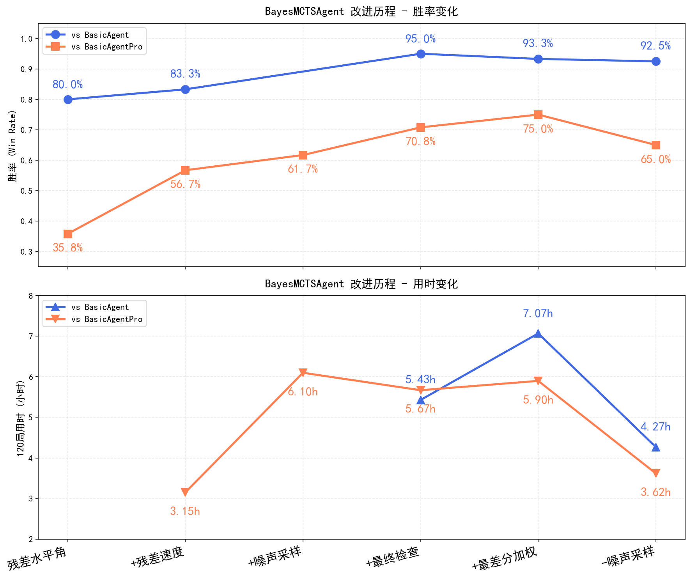

# AI3603-Billiards
AI3603课程台球大作业

## 项目使用说明

`evaluate.py`直接运行即可，`eval/evaluate_with_log.py`可以带参数`-o`指定与BasicAgent（`basic`）抑或BasicAgentPro（`pro`）对战，`-n`指定对战局数。

`eval`和`train`文件夹中的其他文件对于我们的Agent和比赛无用。

**Requirements:**

```bash
pip install -r requirements.txt
```

里程图：



## 关键文件说明

| 文件 | 作用 | 在最终测试中是否可修改 |
|------|------|-----------|
| `poolenv.py` | 台球环境（游戏规则） | ❌ 不可修改 |
| `agents`文件夹 | Agent 定义（在 `new_agent.py` 中实现你的算法） | ✅ 可修改 `new_agent.py` |
| `evaluate.py` | 评估脚本（运行对战） | ✅ 可修改 `agent_b` |
| `PROJECT_GUIDE.md` | 项目详细指南 | 📖 参考文档 |
| `GAME_RULES.md` | 游戏规则说明 | 📖 参考文档 |

对作业内容的视频说明：
说明.mp4：https://pan.sjtu.edu.cn/web/share/da9459405eac6252d01c249c3bcb989f
供大家参考，以文字说明为准。

---
